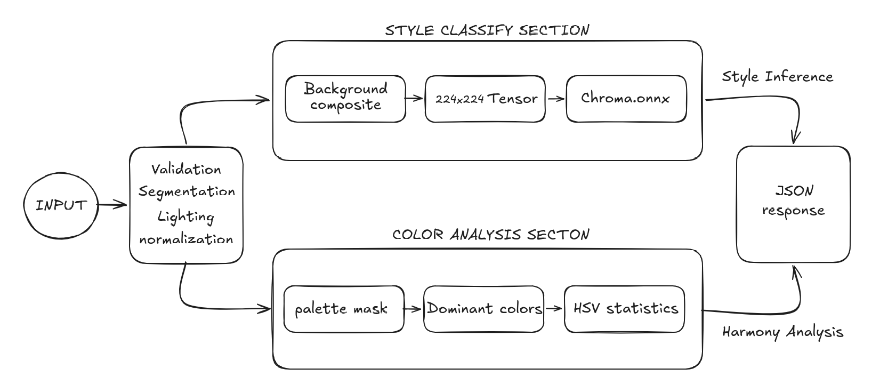
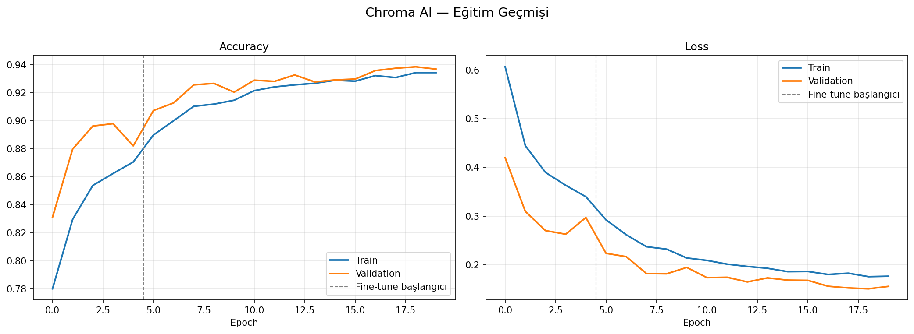

# Chroma AI (Keras Tabanlı Göörüntü İşleme Modelim)

Kullanıcıların giyim tarzını belirleyen, kombinin dominant renklerini algılayıp renk uyum skorunu hesaplayan bir görüntü işleme modeli.

---

## Genel Bakış

Chroma, yüklenen kıyafet görselini analiz ederek iki temel çıktı üretir: modelin öğrendiği stil sınıflarından birine atama yapar ve görseldeki renk paletini renk teorisi çerçevesinde yorumlar. Model EfficientNetV2B2 mimarisi üzerine inşa edilmiş olup 2 fazlı transfer learning stratejisiyle eğitilmiştir.

---

## Inference Mimarisi



### Model

- **Base model:** EfficientNetV2B2 (ImageNet ağırlıkları)
- **Input:** 224×224 RGB görsel
- **Head:** GlobalAveragePooling → BatchNorm → Dense(512) → LayerNorm → Dropout(0.3) → Dense(256) → Dropout(0.2) → Softmax
- **Precision:** Mixed float16 (eğitim), float32 (çıktı katmanı)
- **Format:** ONNX (inference), Keras .keras (eğitim)

### Eğitim Stratejisi

**Faz 1 — Feature Extraction**
- Base model dondurulur, yalnızca head eğitilir
- LR: `1e-3`, EarlyStopping patience: 3
- ReduceLROnPlateau ile adaptif öğrenme hızı

**Faz 2 — Fine-Tuning**
- `block6` ve sonrası açılır, BatchNorm katmanları dondurulur
- LR: `5e-5` → `~3e-6` (epoch başına %15 azalma)
- EarlyStopping patience: 5

---

### Kendi Geliştirdiğim ilk modelim olduğu için hikayesinden biraz bahsetmek istedim

İki faz train gerçekleştirme planım vardı. İlk fazda base modelim train edilemez halde sadece kendi tam bağlı katmanlarım 5 epoch boyunca fashion veri setiyle eğitildi. Ardından ikinci fazda base modelin sadece sonuncu katmanını unfreeze edip eğitilebilir hale getirdim. 15 epoch da bu şekilde eğtimile birlikte harika bir fine tuning örneği oldular. Sonucunda da overfitting olmaksızın %93.87 doğruluğa ulaştım. 

Bu tek seferde olmadı tabi. bu benim ilk keras projemdi ve çok hata yaptım. çok şeyi çözmek, öğrenmek durumunda kaldım. saatler sürecek traini sadece öğrenmek ve nasıl olduğunu bilmek için kendi bilgisayarımda gerçekleştirdim. bu süreçte bilgisayarın adeta kalp atışlarını dinledim. Bütün işlemci çekirdeklerinin ısıları , GPU ve VRAM kullanımlarının nasıl değiştiğini devamlı analiz ettim. İlk trainde bir CPU darboğazı tespit ettim. Bunu çözmek için augmentation pipeline'ı bir katman olarak modele eklemeyi düşündüm. Bu şekilde yük GPU ya kayacaktı ve işlemci rahatlayacaktı. Kendimi çok zeki zannediyordum fakat bu aslında çok yanlış bir karar oldu. CPU nun augmentation işlemini kendisinin yapması, bütün batchler için görüntüleri düzenleyip GPU ya göndermesinden daha basit bir işlemdi. Bu hatayla 6-7 dakika süren epochlar 13 dakikaya fırlayınca hiçbir şeyi çözmediğimi farkettim.
Çözüm yolu araştırdım ciddi bir süre. Mimariyi de eski haline getirdim. 

Ardından CPU ve GPU nun birbirlerini beklemeden çalışabilecekleri asenkron yapılar kurabileceğimi öğrendim. ayrıca batch size düzenlemeleri ile VRAM i daha verimli kullanabileceğimi ve iki faz için farklı olan learning rate değerimin gereksiz düşük kaldığını farkettim. Faz bir için 1e-3 değerleri gayet yeterli gelecekti. Faz iki için de bir scheduler oluşturup her epoch için %15 azalmasını sağladım: 5e-5 → ~3e-6. Bu değişimlerden sonra her epoch artık 3.5 dakikalara düşmüştü. 

Bu hyper parametrelerle ikinci trainde başka bir sorunla karşılaştım. Faz ikiye geçiş anında base modelin 6. bloğunun ağırlıkları traine açılır açılmaz loss değeri tavan yapıyordu. resmen ikinci faz bu fırlamayı düzeltmeyle geçiyordu. Yine birçok şey denedikten sonra base modelin batch normalization katmanını dondurmayı öğrendim. Bunu uyguladığımda faz geçişinde loss fonksiyonu pürüzsüz bir geçiş yaşadı.



---

### Renk Analizi

1. **Arka plan temizleme** — rembg (u2net modeli) ile kıyafet maskesi oluşturulur
2. **Dominant renkler** — k-means (k=5) ile baskın renkler tespit edilir
3. **Nötr filtresi** — siyah, beyaz, gri renkler uyum hesabından ayrı tutulur
4. **Renk teorisi uyumu** — hue açı farkları üzerinden Monokromatik / Analog / Komplementer / Split-Komplementer / Triadik / Karma sınıflandırması yapılır
5. **Stil tahmini** — doygunluk, parlaklık ve renk çeşitliliğine göre sezon/stil önerisi üretilir

---


## Kurulum

### Gereksinimler

```
fastapi>=0.110.0
uvicorn>=0.29.0
python-multipart==0.0.9
opencv-python-headless==4.8.1.78
numpy<2.0.0
Pillow>=10.0.0
rembg==2.0.57
onnxruntime==1.16.3
```

### Lokal Çalıştırma

```bash
git clone <repo>
cd <repo>
pip install -r requirements.txt
uvicorn main:app --host 0.0.0.0 --port 7860
```

### Docker

```bash
docker build -t chroma-ai .
docker run -p 7860:7860 chroma-ai
```

---

## Proje Yapısı

```
├── main.py              # FastAPI backend
├── requirements.txt
├── Dockerfile
└── saved_model/
    ├── Chroma.onnx      # Inference modeli
    └── class_names.json # Sınıf isimleri
```
---

## Notlar

- Model `.keras` formatında eğitilip `tf2onnx` ile ONNX'e dönüştürülmüştür. Bu sayede inference için TensorFlow bağımlılığı kaldırılmış, `onnxruntime` ile hafif ve taşınabilir bir deployment sağlanmıştır.
